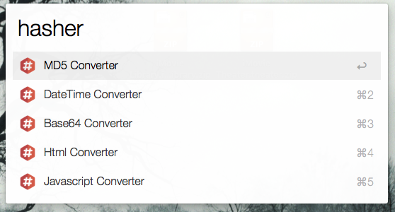
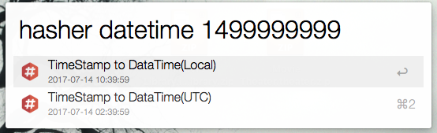
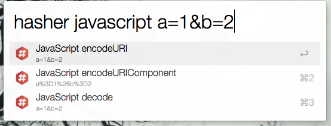

# Alfred2 Hasher (Support Alfred3, Alfred4)

----------------------------------------
### What's Hasher
The Alfred2 Workflow `Hasher` can convert anything like `MD5`, `datetime`, `Base64`, etc.

Inspired from [Hasher (Chrome extension)](https://github.com/s12v/hasher)

Thanks to [Alfred-Workflow](https://github.com/deanishe/alfred-workflow)

[Download](https://github.com/dozer47528/alfred2-hasher/releases)

&nbsp;

### Screenshot

&nbsp;

### How to use

* `hasher [anything]` -> `Select any one` -> `Press Enter`: Get all result, select one and copy to clipboard.
* `hasher [converter name prefix]` -> `tab` : Converter name auto complete.
* `hasher [converter name] [anything]` -> `Select result` -> `Press Enter`: Specify the converter and convert the input, select one and copy to clipboard.

&nbsp;

### Supported Converter

* MD5
* Base64
* ASCII
* String: Lowercase, Uppercase
* DateTime: Now, Timestamp to DateTime, DateTime to Timestamp
* Html: Encode, Decode
* JavaScript: JavaScript encodeURI, encodeURIComponent, decode
* SHA: SHA1, SHA223, SHA256, SHA384, SHA512
* Number: Dec, Bin, Oct, Hex
* UUID: New UUID, Remove dash in UUID, Format UUID with dash
* Naming: Camel, Snake, Pascal, Kebab

&nbsp;

### What's Next

* Add more converter.
